# 🐾 Anabul Care (anabul-care)
> **Smart, Personalized Pet Care & Health Assistant** — Engineered with SwiftUI, SwiftData, WidgetKit, watchOS companion integration, and local iOS system hooks.

[](https://developer.apple.com/swift/)
[](https://developer.apple.com/ios/)
[](https://developer.apple.com/xcode/swiftdata/)
[](https://developer.apple.com/documentation/xcode/running-unit-tests-and-ui-tests)

---

## 🌟 Overview
**Anabul Care** (derived from *"Anak Bulu"*, a loving Indonesian term for pets) is a comprehensive health tracker and personalized routine assistant designed to elevate how owners care for their dogs and cats.

The ecosystem comprises:
1. **SwiftUI Native iOS App:** A robust, reactive mobile application utilizing modern architectural patterns (MVVM), SwiftData for persistence, and local iOS APIs (Core Spotlight, MapKit).
2. **watchOS Companion App:** Seamless on-the-go tracking allowing quick activity logging and routine checklists, synced in the background via `WCSession`.
3. **WidgetKit Extension:** Glancable widgets displaying current pet stats and upcoming schedule alerts directly on the iOS Home Screen.

---

## 🗺️ System Architecture (Class Diagram)

Below is the **Ultimate Truth Class Diagram** detailing the entity relationships, view models, and views matching 1:1 with the actual Swift codebase.

```mermaid
classDiagram
    %% ==========================================
    %% MODULE 1: DATA MODELS (ENTITIES)
    %% ==========================================
    class PetProfile {
        <<@Model>>
        +UUID id
        +String name
        +String species
        +String breed
        +Date dateOfBirth
        +Double weightKg
        +Bool isNeutered
        +activities: [ActivityLog]
        +init(id: UUID, name: String, species: String, breed: String, dateOfBirth: Date, weightKg: Double, isNeutered: Bool)
        +petSpecies: PetSpecies <<computed>>
        +ageInMonths: Int <<computed>>
        +lifeStage: LifeStage <<computed>>
    }

    class ActivityLog {
        <<@Model>>
        +UUID id
        +Date timestamp
        +String type
        +Int durationMinutes
        +String detail
        +PetProfile? pet
        +init(id: UUID, timestamp: Date, type: String, durationMinutes: Int, detail: String)
    }

    class SpeciesRuleModel {
        <<@Model>>
        +String species
        +Int rerConstant
        +Double heatThresholdCelsius
        +toxicHazards: [ToxicityModel]
        +init(species: String, rerConstant: Int, heatThresholdCelsius: Double)
    }

    class ToxicityModel {
        <<@Model>>
        +UUID id
        +String keyword
        +String dangerLevel
        +String alternative
        +SpeciesRuleModel? speciesRule
        +init(id: UUID, keyword: String, dangerLevel: String, alternative: String)
    }

    class ClinicModel {
        +UUID id
        +String name
        +CLLocationCoordinate2D coordinate
        +String address
        +String phone
        +POICategory category
        +MKMapItem? mapItem
        +init(id: UUID, name: String, coordinate: CLLocationCoordinate2D, address: String, phone: String, category: POICategory, mapItem: MKMapItem?)
    }

    %% Entity Internal Relationships
    PetProfile "1" *-- "0..*" ActivityLog : @Relationship(cascade)
    SpeciesRuleModel "1" *-- "0..*" ToxicityModel : @Relationship(cascade)

    %% ==========================================
    %% MODULE 2: VIEWMODELS (LOGIC LAYER)
    %% ==========================================
    class DashboardViewModel {
        <<@Observable>>
        +pets: [PetProfile]
        +selectedPetID: UUID?
        -repository: PetRepositoryProtocol
        -modelContext: ModelContext
        +init(repository: PetRepositoryProtocol, modelContext: ModelContext)
        +fetchPets() Void
        +currentPet: PetProfile? <<computed>>
        +currentDateString: String <<computed>>
        +todayTaskCount(for pet: PetProfile?) Int
        +dynamicGreetingSubtext(for pet: PetProfile?) String
        +handleWatchPayload(payload: [String: Any]) Void
        +syncAllToWatch() Void
        -logActivityFromWatch(petName: String, activityType: String) Void
    }

    class RoutineViewModel {
        <<@Observable>>
        +dailyTasks: [DailyTaskItem]
        +selectedDate: Date
        +activeEditingTask: DailyTaskItem?
        +isCustomTimeSheetPresented: Bool
        -pet: PetProfile
        -repository: PetRepositoryProtocol
        -modelContext: ModelContext
        +init(pet: PetProfile, repository: PetRepositoryProtocol, modelContext: ModelContext)
        +fetchTasks() Void
        +toggleTask(task: DailyTaskItem) Void
        +isTaskCompleted(task: DailyTaskItem) Bool
        +updateTimePreference(for task: DailyTaskItem, newTime: String) Void
        +deactivateTask(task: DailyTaskItem) Void
        +activateTask(task: DailyTaskItem) Void
        +isTaskDeactivated(task: DailyTaskItem) Bool
    }

    class ToxicityViewModel {
        <<@Observable>>
        +searchResults: [ToxicityModel]
        +searchText: String
        +isSafeToEat: Bool?
        -modelContext: ModelContext
        +init(modelContext: ModelContext)
        +search(query: String, species: String) Void
        +checkSafety(item: String, species: String) Void
    }

    class RadarViewModel {
        <<@Observable>>
        +position: MapCameraPosition
        +clinics: [ClinicModel]
        +selectedClinic: ClinicModel?
        +searchText: String
        +selectedCategory: POICategory
        +currentCenter: CLLocationCoordinate2D
        +currentDistance: Double
        +init()
        +filteredClinics: [ClinicModel] <<computed>>
        +searchForRegion(query: String) async
        +performSearch(in region: MKCoordinateRegion) async
        -isRelevant(name: String, category: POICategory) Bool
        +zoomIn() Void
        +zoomOut() Void
        +openInAppleMaps(clinic: ClinicModel) Void
        +openInGoogleMaps(clinic: ClinicModel) Void
    }

    class AddPetViewModel {
        <<@Observable>>
        +name: String
        +species: PetSpecies
        +breed: String
        +birthDate: Date
        +weight: String
        +isNeutered: Bool
        +availableBreeds: [String]
        -repository: PetRepositoryProtocol
        +init(repository: PetRepositoryProtocol)
        +savePet() Bool
        +updateAvailableBreeds() Void
    }

    class PetProfileViewModel {
        <<@Observable>>
        +pet: PetProfile
        +weightInput: String
        +isNeutered: Bool
        -repository: PetRepositoryProtocol
        +init(pet: PetProfile, repository: PetRepositoryProtocol)
        +updateWeight() Void
        +updateNeuteredStatus() Void
        +deletePet() Void
    }

    %% VM to Model Connections
    DashboardViewModel --> PetProfile : manages array
    RoutineViewModel --> PetProfile : focus target
    ToxicityViewModel --> ToxicityModel : queries
    RadarViewModel --> ClinicModel : searches & filters
    PetProfileViewModel --> PetProfile : edits

    %% ==========================================
    %% MODULE 3: VIEWS (UI LAYER)
    %% ==========================================
    class ContextualDashboardView {
        <<view>>
        +viewModel: DashboardViewModel
        -selectedTab: Int
        +body: some View
    }

    class RoutineView {
        <<view>>
        +viewModel: RoutineViewModel
        +body: some View
    }

    class ToxicityLookupView {
        <<view>>
        +viewModel: ToxicityViewModel
        +species: String
        +body: some View
    }

    class PuskeswanRadarView {
        <<view>>
        +viewModel: RadarViewModel
        +body: some View
    }

    class TodayQueueCardView {
        <<view>>
        +viewModel: RoutineViewModel
        +pet: PetProfile
        +body: some View
    }

    %% View to VM Dependency Connections
    ContextualDashboardView ..> DashboardViewModel : uses
    RoutineView ..> RoutineViewModel : uses
    ToxicityLookupView ..> ToxicityViewModel : uses
    PuskeswanRadarView ..> RadarViewModel : uses
    TodayQueueCardView ..> RoutineViewModel : uses

    %% ==========================================
    %% EXTERNAL REPOSITORY & SERVICES
    %% ==========================================
    class PetRepository {
        <<service>>
    }
    class PetRepositoryProtocol {
        <<interface>>
    }
    PetRepository ..|> PetRepositoryProtocol : realizes
    DashboardViewModel o-- PetRepositoryProtocol : delegates to
    RoutineViewModel o-- PetRepositoryProtocol : delegates to
    AddPetViewModel o-- PetRepositoryProtocol : delegates to
    PetProfileViewModel o-- PetRepositoryProtocol : delegates to
```



---

## ⚡ Core Features

### 📅 Smart Daily Routine Engine
Generates highly customized daily routines tailored to:
- **Breed-Specific Physical Traits:** e.g., low-intensity exercises ("Light Stroll") instead of "Morning Walks" for *Brachycephalic* dogs like Pugs to prevent respiratory distress.
- **Energy Levels & Age:** Vigorous training routines for active puppies (e.g., Siberian Huskies), and joint supplement alerts/grooming checkups for senior animals.
- **Temporal Triggers:** Dynamically transitions weekend routines (e.g., switching daily litter scoop to a deep litter box cleaning on Sundays).

### 🍖 Toxicity Lookup & Core Spotlight
- Instantly checks if a food item is toxic for a specific species (dogs vs cats).
- Provides instant medical explanations of danger levels alongside safe culinary alternatives.
- Integrates with Apple’s **Core Spotlight** (`CSSearchableItem`), allowing users to search for toxic foods directly from their iOS home screen search bar without opening the app.

### 🧭 Clinic & Radar Map (Puskeswan Radar)
- Interactive map interface tracking veterinary clinics and pet-friendly parks.
- Filter clinics instantly by category (`.vet`, `.all`).
- Direct action shortcuts allowing users to navigate directly via Apple Maps or Google Maps.

### ⌚ watchOS Background Synchronizer
- Allows instant check-in and tracking of pet feeding and medication directly from the watch.
- Uses `WCSession` back-channel syncing to communicate logs silently between Apple Watch and iOS.

---

## 🧪 Testing Suite & Quality Assurance
The codebase features a solid coverage of **17 unit test cases** targeting core system rules:

1. **`LocationManagerTests` (Concurrency Control):**
   - Assures that 10 concurrent requests to the GPS locator do not cause race conditions. Resolves location asynchronously using Swift continuations.
2. **`MetabolismEngineTests` (Veterinary Calculations):**
   - RER (Resting Energy Requirement) formula: $70 \times \text{weight}^{0.75}$.
   - MER (Maintenance Energy Requirement) formula adjustments (e.g., factor of `1.6` for neutered dogs vs `1.4` for intact cats).
3. **`RoutineGenerationTests` (Heuristics Validation):**
   - Validates that Husky puppies get lunch schedules, Pugs get light breathing-friendly exercises, and senior cats get joint supplement reminders.
4. **`ToxicityFeatureTests` (Database Integrity):**
   - Assures JSON database parsing is valid, containing safety alerts for ingredients like chocolate/cocoa.
5. **`PetRepositoryTests` (Data Association):**
   - Verifies cascades, object mutations, and bidirectionality between `PetProfile` and `ActivityLog` records.

---

## 🛠️ Codebase Structure

```
anabul-care/
├── anabul-care/                     # iOS Native Target Source Code
│   ├── Models/                      # SwiftData Schema entities
│   ├── ViewModels/                  # Observable ViewModels (iOS)
│   ├── Views/                       # SwiftUI Views (Dashboard, Map, Routine, etc)
│   ├── Services/                    # Location, Metabolism, Daily Routine managers
│   ├── Extensions/                  # Shared Swift Extensions
│   └── Resources/                   # Asset catalogues, toxicity JSON databases
├── Anabul-care-WatchOS Watch App/   # watchOS Target Source Code
│   ├── Views/                       # Watch specific interfaces
│   └── ViewModels/                  # Watch connectivity and dashboard controllers
├── Anabul-careWidget/               # Home screen widget target
├── anabul-careTests/                # XCTest unit testing suite
├── anabul-careUITests/              # XCUITest user interface suite
└── Anabul-care-WatchOS Watch AppTests
```

---

## 🚀 Getting Started

### Native iOS & watchOS App
1. Open the project folder (`anabul-care.xcodeproj`) in **Xcode 15+**.
2. Select target `anabul-care` and choose your preferred Simulator (iOS 17+).
3. Press `Cmd + R` to compile and run.
4. *(Optional)* Select the `watchOS` scheme and run on Apple Watch Simulator to test live syncing.

---

*Made with ♥ by Team 5 (Stevanus Ivan, Nicholas Gerwin, Filemon Jose).*
